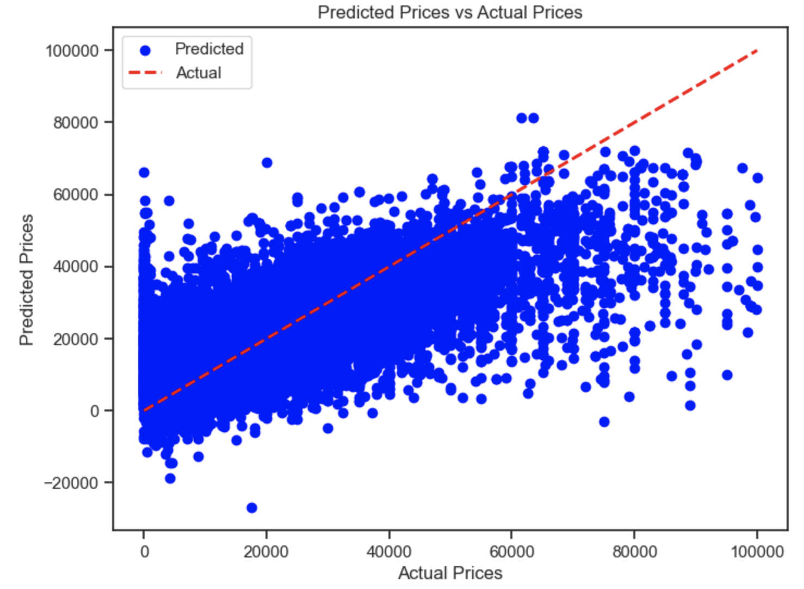

# Module11
Module11_Practical Application

## Overview
The purpose of this practical application is to use the CRoss Industry Standard Process for Data Mining (CRISP-DM) process as a methodological framework from which program participants are to derive a recommendation for a fictitious client attempting to predict the price of automobiles based on a large historical dataset with several auto features.

CRISP-DM is comprised of six phases: business understanding, data understanding, data preparation, modeling, evaluation and deployment. In this practical application all phases but the deployment phase are utilized. Throughout the Jupyter notebook markdowns were used to explain each step of the process as I worked through the process towards presenting findings and providing recommendations.

In this repository, a brief summary of findings will presented along with recommendations for the client.

## Summary

