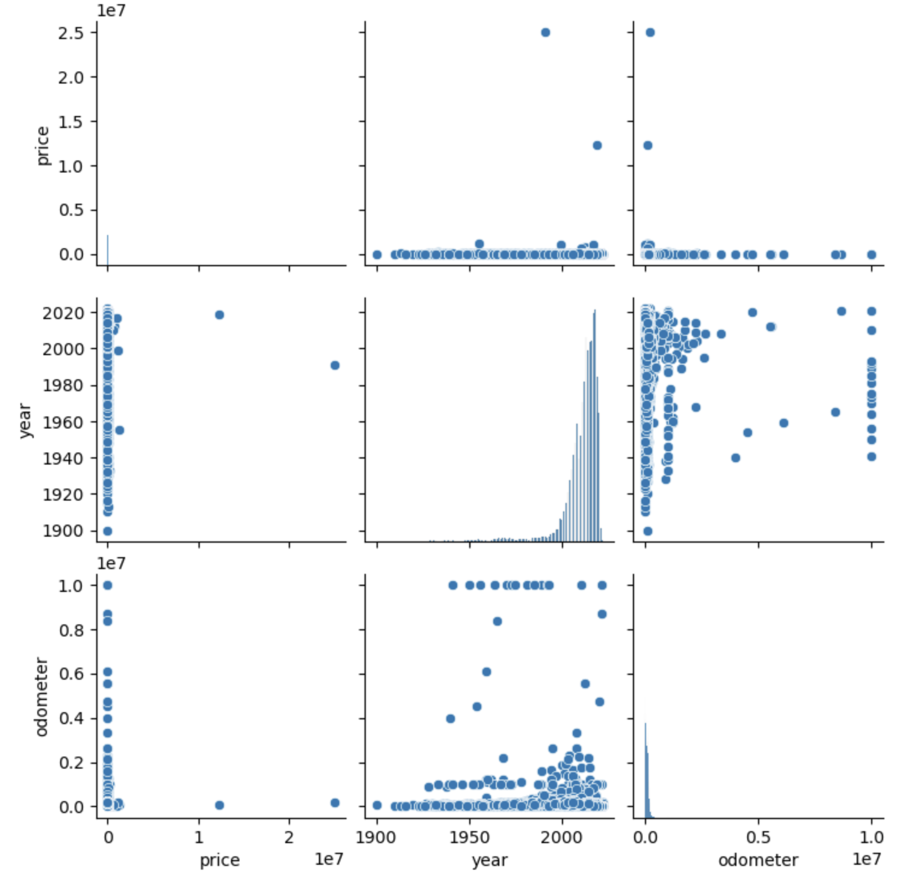
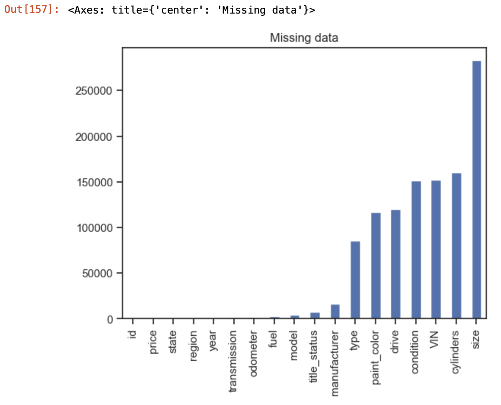
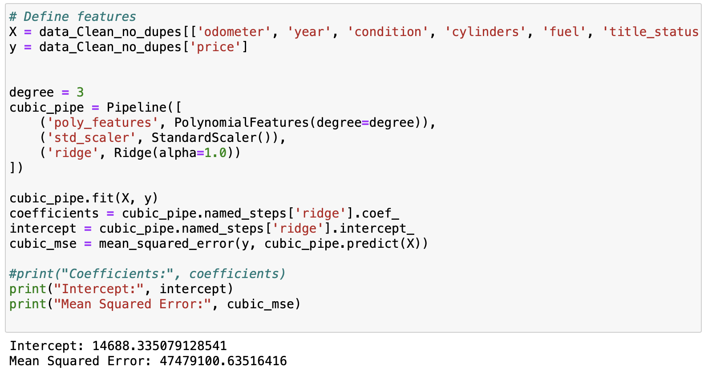

# Module11
Module11_Practical Application

## Overview
The purpose of this practical application is to use the CRoss Industry Standard Process for Data Mining (CRISP-DM) process as a methodological framework from which program participants are to derive a recommendation for a fictitious client attempting to predict the price of automobiles based on a large historical dataset with several auto features.

CRISP-DM is comprised of six phases: business understanding, data understanding, data preparation, modeling, evaluation and deployment. In this practical application all phases with the exception of the deployment phase are utilized. Throughout the Jupyter notebook markdowns were used to explain each step of the process as I worked through the process towards presenting findings and providing recommendations.

In this repository, a brief summary of the process used and findings from the Modeling phase will presented along with recommendations for the client.

## Summary
Consulting engagements typically start with a small army of business consultants sitting down with the client in attempts to understand the business question. For this practical application the business question is very simple: provide an analytically backed recommendation for the client explaining which auto features increase car prices. Understanding the business question is vastly different from understanding the business itself.

Once the business question has been clearly defined, the next step is to understand the business. Auto dealerships are retail outlets selling higher priced goods. Like any business, owners must be aware of typical business metrics such as margins, demand, yields, ect. By being aware of which auto features increase sales price, the owner can correctly price the auto for resale or purchase car with higher demand to restock inventory. In this instance the data can be thought of as the business, meaning we do not have any back information informing us about the business itself. 

The dataset to be used for the modeling process contains a large amount of unique rows and approximately a dozen descriptive features of autos. But a brief description of the actual data file is not sufficient to fulfill the second phase of CRISP-DM, that of understand the data. Understanding the data is the process of investigating the data at the feature and row level. Questions driving this phase include: how many unique data variables in each feature?, are there outliers?, how much missing data is present,? how to handle missing data?, etc. 

For myself, understanding the data typically begins with visual review of the data. This can be accomplished several ways: run a df.head() function or a pairplot of integers. Data professionals should be able to visually review and see apparent issues (see the pairplot below). Additional data exploration include running counts of missing data by feature and creating a plot to visualize the size of the issue. Below we can see that the 'size' feature has the largest amount of missing values at over 250,000 rows. Another important discovery is that just under 33,000 rows of 'price' value is equal to 0. Zero is not missing, but simply put, we cannot train or validate a model with target value of $0.00. Investigative steps like the previous examples continued for each of the features.

Outliers impacting corrolation distribution:

Missing data by feature:

Understanding the data helps define the scope for the amount of effort needed in preparing the data for use in modeling. Besides fixes for missing values, several features were omitted from the analysis because they would not add any explanatory power to the model. Examples of these features include the vehicle's 'VIN' and the 'state' recording the transaction. Data preparation also includes data transformations. Examples of data transformations take several forms, such as imputations (not used in this analysis), binning (used for 'year' feature) and recoding (onehotencoding for several features including 'paint_color').

Modeling follows the data preparation step. For this practical application a thorough modeling process was undertaken in effort to identify a model that clearly provides actionable insights for the client. 
Models created for the client include: OLS, linear regressions with various feature counts, polynomial feature regression models with various degrees and polynomial feature ridge model.  

In evaluating model outputs, the ridge model using a highly curated dataset provided an output that outperformed other models based on the evaluation criteria of mean squared error and R-squared or intercept depending on the model method used. This model was selected to use in providing the findings for the client. Findings provided to the client (see below) speak to best performant attributes in each feature. In plain english, the client can read the recommendations and apply those learnings to pricing. It is also worth noting that combining findings from each feature will optimize price predictions.

What is not discussed is operationalizing the model outputs at the coefficient grain into a usable tool. This could be accomplished by creating a front-end user form that the client could fill-in auto attributes and execute a macro that would run against the winning model return a prediction (or optimized pricing) for that vehicles maximum sales price. 

## Findings for the client
The proposed client in this practical application is a used car dealership. Their request to to provide a clear understanding of the features that increase car values. Overall findings based on the best performing model (by measure of mean square error) containing the largest number of features resulted in the following recommendations:

1. Odometer: The odometer reading (auto mileage) has a significant impact on the predicted price. Cars with lower mileage tend to have higher prices.

2. Year (of manufacture): The year plays a crucial role in predicting the price. Newer cars usually command higher prices, while older cars may have lower prices.

3. Condition: The condition of the car affects its price. Cars rated as new or like new have higher prices compared to those in poorer condition.

4. Cylinders (number of): The number of cylinders in the engine influence price. Generally, the more cylinders an engines has the higher-priced it will be.

5. Fuel_Type: The type of fuel used by the vehicle can affect its price. For example, electric or hybrid vehicles have higher prices.

6. Title Status: The title status impacts price, clean titles and titles with a lien are typically associated with higher prices compared to salvage or parts only titles.

7. Vehicle Type: The type of vehicle (e.g., sedan, SUV, truck) can also affect its price, with certain types being more desirable and thus having higher prices. Trucks/pickups and convertables preformed well in the model. Hatchbacks and sedans performed poorly compartive to other vehicle types.

8. Manufacturer: The manufacturer code represents different car brands, and certain brands have higher perceived value, leading to higher prices. High-end manufacturers performing well: Ferrari, AstinMartin and Tesla. SUV manufacturers performing well include: Land Rover, Range Rover and Jeep. Mass market manufacturers performing well: Toyota, Subaru, Chevy, Mazda and Ford.

9. Color: Auto color can impact price. As found in the modeling process orange and purple performed well, but taken in context, a few high-end cars with these color skewed the data. Overall, white performed better than blue, grey and silver.

Overall, the model suggests that these features collectively contribute to predicting car prices. By analyzing these features, the used car business can gain insights into how each characteristic affects the pricing of vehicles in their inventory. This information can be valuable for setting competitive prices, understanding market trends, and making informed decisions about buying and selling used cars.

